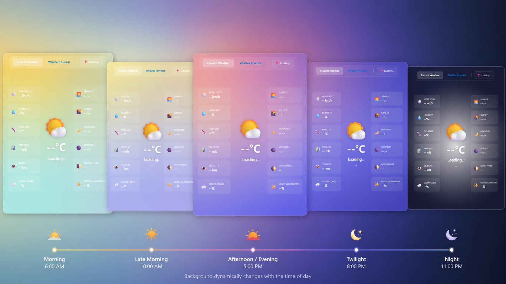
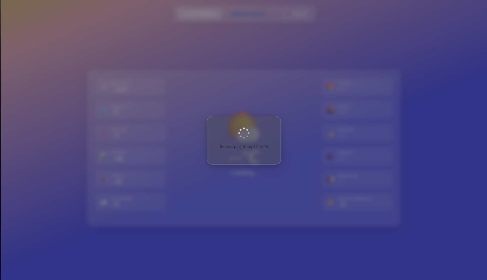
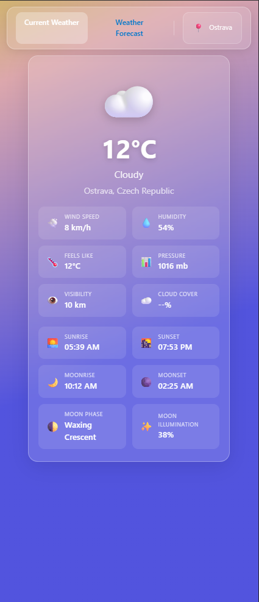
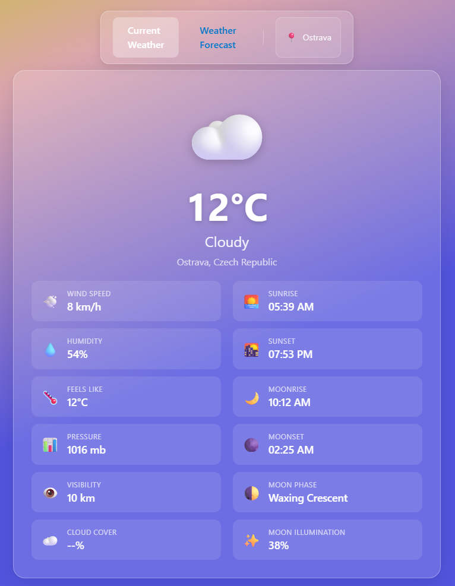

# Weatherstack API Showcase Project

> ⚠️ **Note:** This project was previously named *PrezentacniProjekt*.  
> Any remaining references to the old name are considered deprecated.

## 📌 Overview

This project is a **.NET showcase application** built around integration with the **Weatherstack API**.

It was created as a **portfolio project for junior / junior+ backend developer roles**, with focus on clean project structure, external API integration, basic authentication, resilience, caching, and testability.

The solution consists of:

* `ShowcaseProject.Rest` – REST API backend
* `ShowcaseProject.Web` – MVC frontend consuming the REST API
* `ShowcaseProject.Shared` – shared DTOs and models
* `ShowcaseProject.Tests` – automated tests

## 🚀 Features

* External API integration with Weatherstack
* REST API built with ASP.NET Core
* MVC frontend for manual testing / presentation
* Basic Authentication
* Resilience using Polly
* In-memory caching
* Swagger (OpenAPI)
* Health checks
* Structured logging
* Automated testing

## ⚙️ Setup

1. Clone repository:

```bash
git clone https://github.com/lampartondrej/WeatherstackAPIShowcaseProject.git
cd WeatherstackAPIShowcaseProject
```

2. Configure environment variables:

* `WeatherApiKey`
* `ShowcaseProjectApiUsername`
* `ShowcaseProjectApiPassword`

3. Run the REST API:

```bash
dotnet run --project ShowcaseProject.Rest
```

4. (Optional) Run MVC frontend:

```bash
dotnet run --project ShowcaseProject.Web
```

5. Open Swagger UI after startup to test the REST API endpoints.

## 🔐 Authentication

The API uses **Basic Authentication**.

Credentials must be provided via environment variables:

* `ShowcaseProjectApiUsername`
* `ShowcaseProjectApiPassword`

Authenticated requests must include the `Authorization` header in Basic Auth format.

## 🧪 Testing

Run all tests:

```bash
dotnet test
```

The test project validates the main application flow and selected backend behaviors.

## 📸 Screenshots

### Current Weather View


### Forecast View


### Swagger


---

## 🎨 UI Showcase

### 🌅 Dynamic Background (Time of Day)

The application dynamically updates its background gradient based on the time of day (morning, afternoon, evening, night).  
This enhances the user experience by visually reflecting real-world conditions and creating a more immersive interface.



---

### 🔄 Retry Mechanism (Frontend Feedback)

In case of a failed request, the frontend automatically retries the operation and provides visual feedback to the user.  
The retry state is clearly communicated (including attempt count), improving transparency and overall UX.



---

### 📱 Mobile Layout

The UI is fully responsive and optimized for mobile devices.  
Layout adapts to smaller screens with stacked components and improved readability.



---

### 💻 Tablet Layout

The application also supports tablet view, balancing between desktop and mobile layouts.  
Components are reorganized to utilize available space while maintaining clarity.



---

> Note: depending on the external provider plan, forecast support may be limited.  
> In this project, the architecture and endpoint flow are implemented regardless of provider-tier constraints.

## 📎 Notes

* This project is intended for demonstration purposes and as a portfolio showcase.
* It is not intended to be treated as a production-ready system.
* The main goal is to demonstrate backend-oriented development practices in a small but complete .NET solution.
