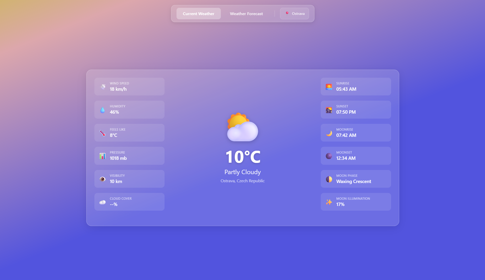
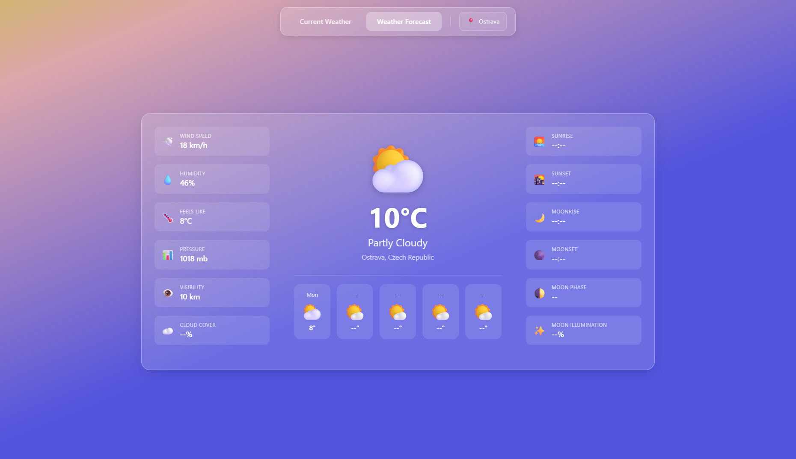
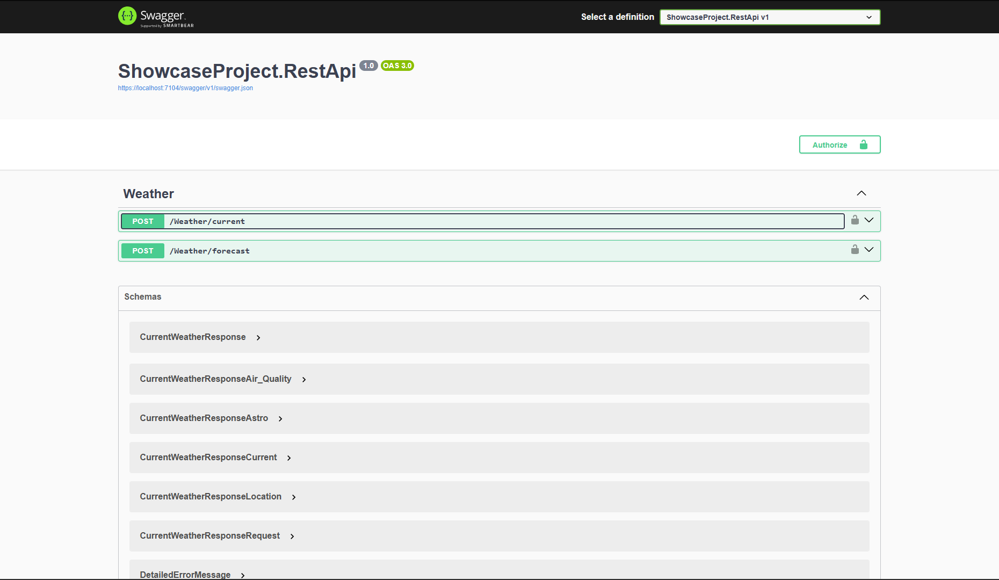

# Weatherstack API Showcase Project

> ⚠️ **Note:** This project was previously named *PrezentacniProjekt*.
> Any remaining references to the old name are considered deprecated.

## 📌 Overview

This project is a **.NET backend showcase application** demonstrating integration with the Weatherstack API.

It is designed as a **portfolio project for junior / junior+ backend developer roles**.

The solution consists of:

* `ShowcaseProject.Rest` – REST API backend
* `ShowcaseProject.Web` – MVC frontend
* `ShowcaseProject.Shared` – shared DTOs and models
* `ShowcaseProject.Tests` – integration tests

## 🚀 Features

* External API integration (Weatherstack)
* Basic Authentication
* Resilience using Polly
* In-memory caching
* Swagger (OpenAPI)
* Health checks
* Integration testing

## ⚙️ Setup

1. Clone repository:

```bash
git clone https://github.com/lampartondrej/WeatherstackAPIShowcaseProject.git
cd WeatherstackAPIShowcaseProject
```

2. Configure environment variables:

* `WeatherApiKey`
* `ShowcaseProjectApiUsername`
* `ShowcaseProjectApiPassword`

3. Run the REST API:

```bash
dotnet run --project ShowcaseProject.Rest
```

4. (Optional) Run MVC frontend:

```bash
dotnet run --project ShowcaseProject.Web
```

## 🔐 Authentication

The API uses **Basic Authentication**.

Credentials must be provided via environment variables:

* `ShowcaseProjectApiUsername`
* `ShowcaseProjectApiPassword`

## 🧪 Testing

Run tests:

```bash
dotnet test
```

## Screenshots

### Current Weather View



### Forecast View



### Swagger



> Note: depending on the external provider plan, forecast support may be limited. In this project, the architecture and endpoint flow are implemented regardless of provider-tier constraints.

## 📎 Notes

* This project is intended for demonstration purposes and is not production-ready.
